# Project Description
This project is a homework assignment to teach how to get Pycharm setup with Docker, Flask, MySQL, and Postman
# Postman Screenshot 
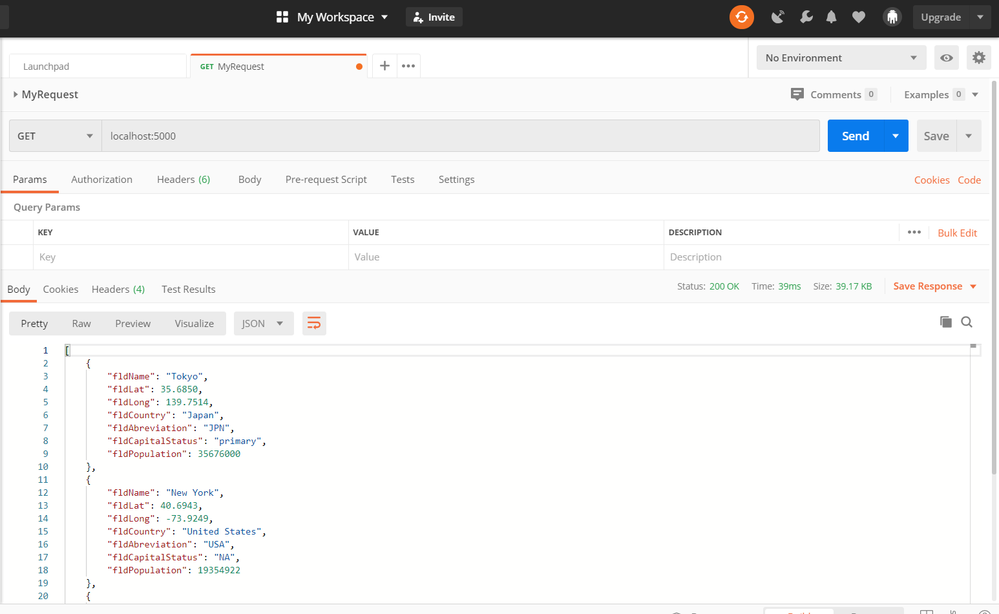
# SQL Data Screenshot
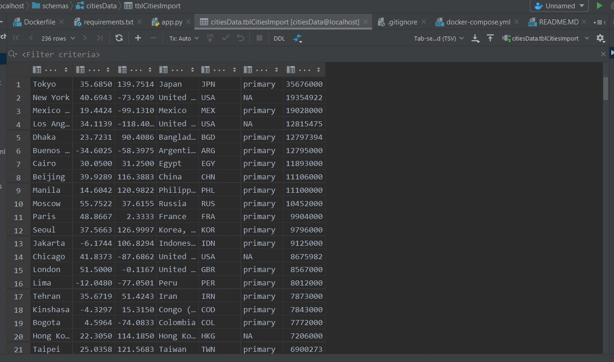
# Displaying Data using html
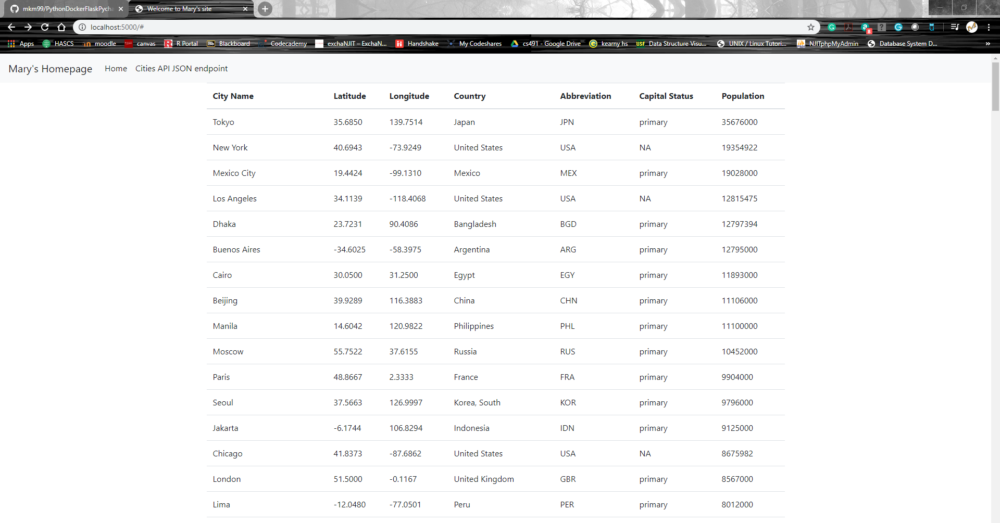
# Postman Screenshot using HTML to display data in tables
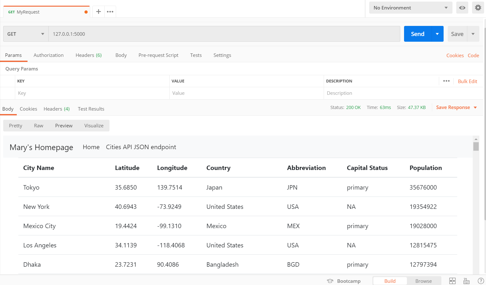

-----------------------------------------------------------------------

# Lesson 3
This is part 1 of the Final Project
# Data table in Pycharm
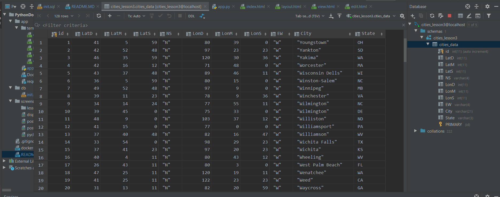
# Data table displayed in Chrome
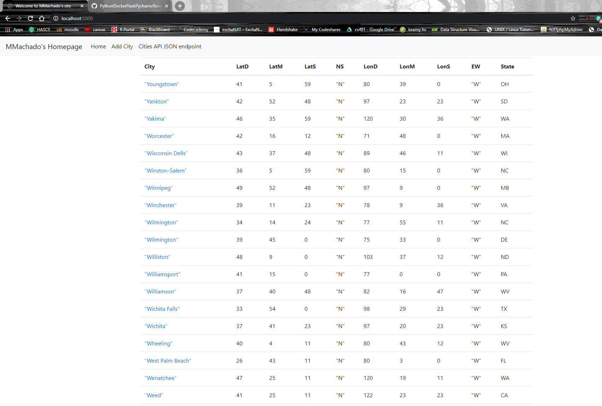
# One record displayed in Chrome
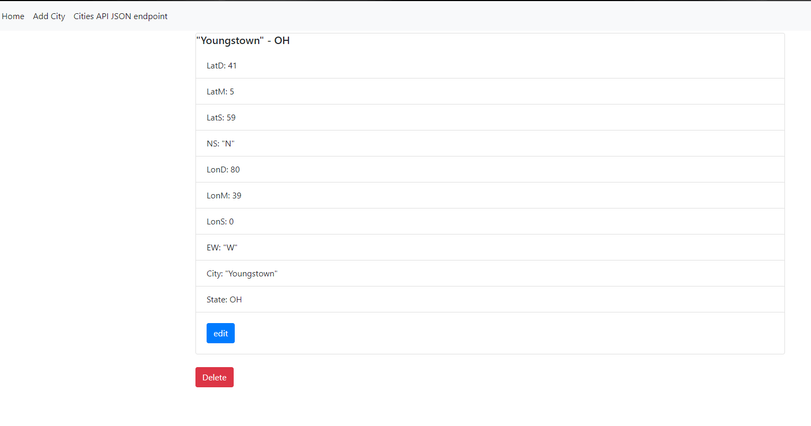
# New record added to table displayed in Chrome
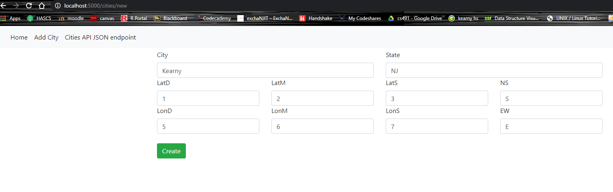
# Display new record in Chrome
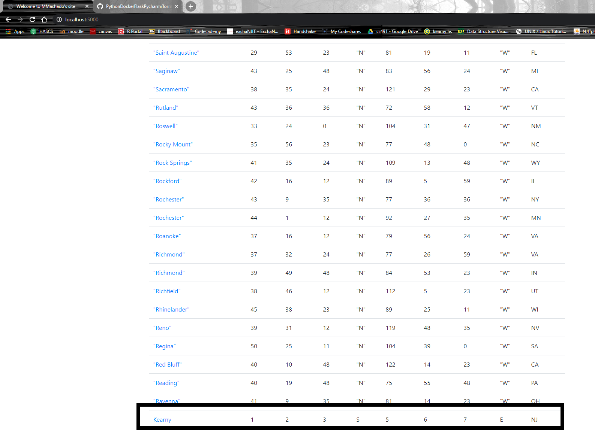
# Record updated displayed in Chrome
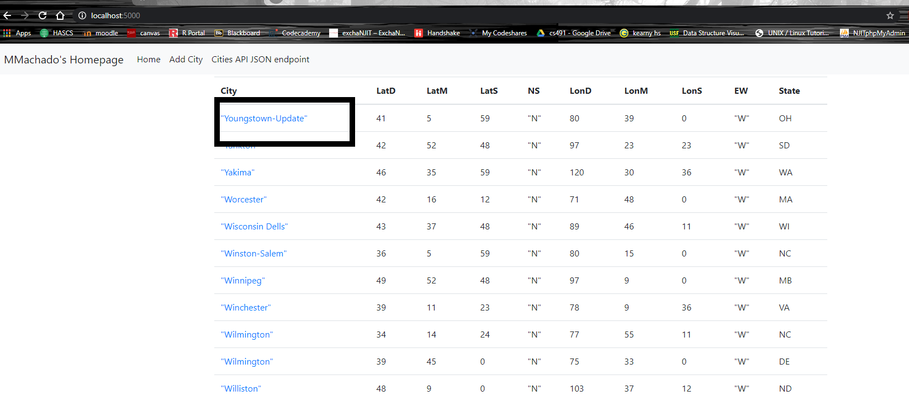
# Deletion of Record displayed in Chrome
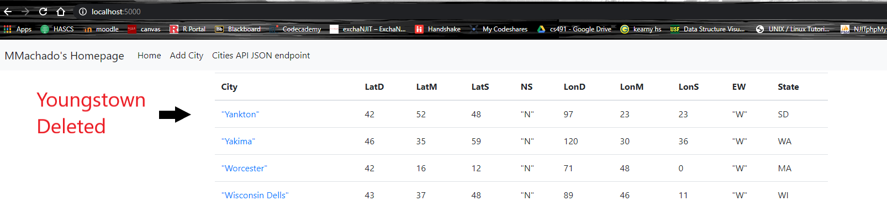

-----------------------------------------------------------------------

# Lesson 4
This is part 2 of the Final Project
# Display data with Postman
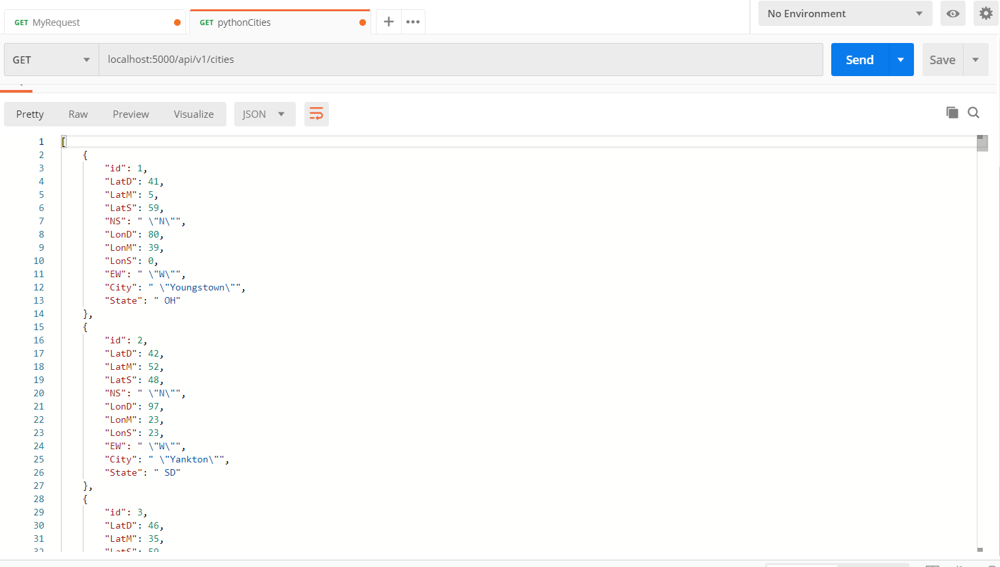
# Display one record with Postman - GET request
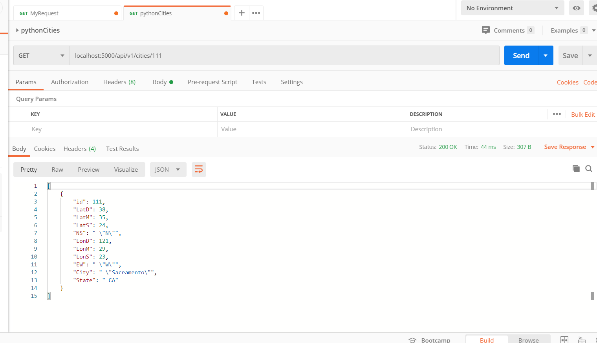
# Create a new record using Postman - POST request
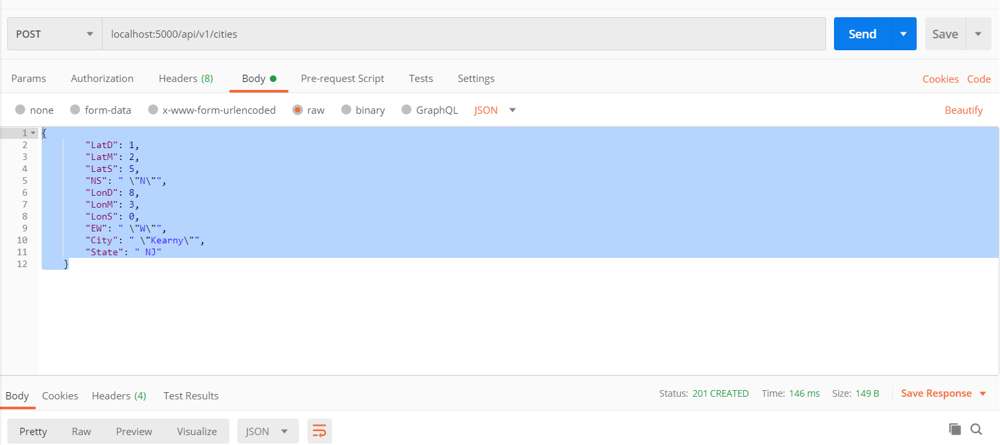
# Display new record created
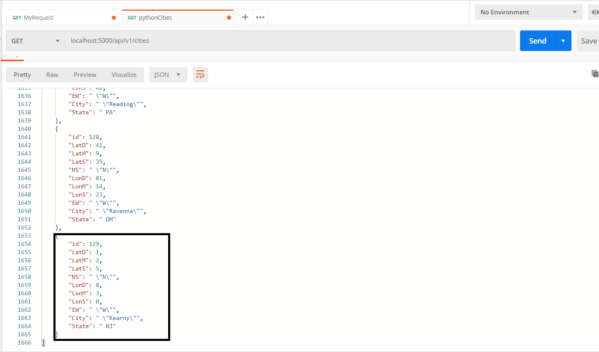
# Update a record using Postman - PUT request
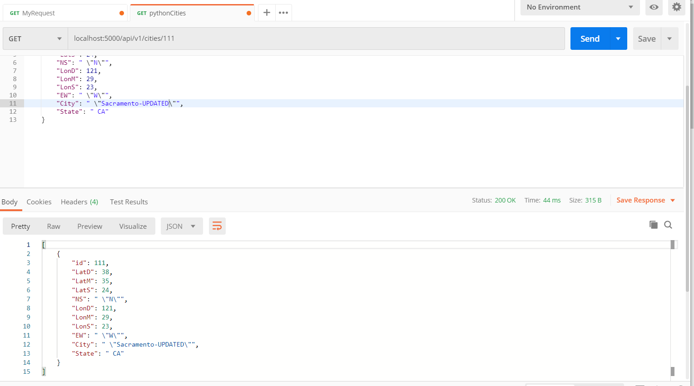
# Delete a record using Postman - DELETE request 
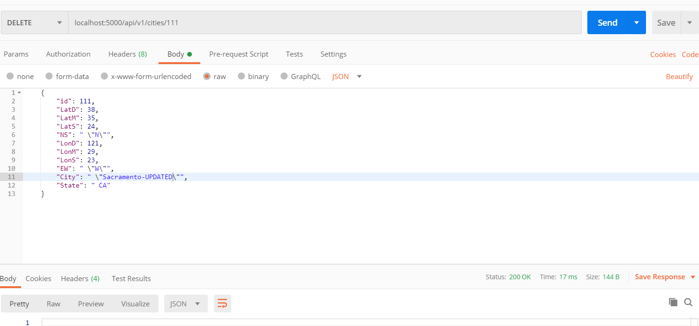
# Display data without deleted record
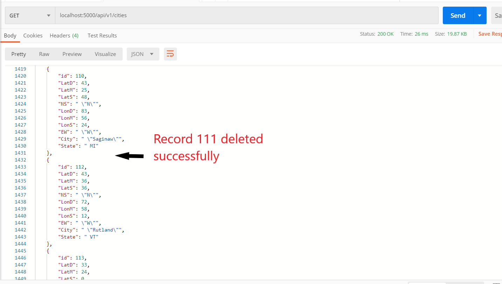